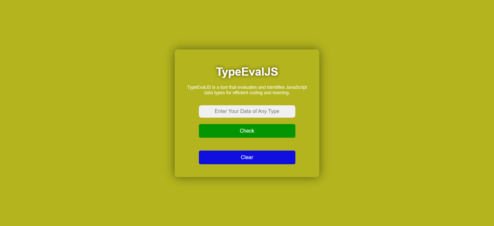

# TypeEvalJS

**TypeEvalJS** is a tool that evaluates and identifies JavaScript data types. Whether you're working with numbers, strings, booleans or null values. It provides a seamless experience for developers and learners.

## 🔎 Demo Screenshot



## 🔗 Live Demo

Check out the app live here: **[TypeEvalJS](https://premkrrajbhar.github.io/TypeEvalJS/)**

## 📝 Features

- **Instant Data Type Detection**: Quickly identifies JavaScript data types like numbers, strings, booleans, null and more.
- **Ideal for Learning**: Perfect for beginners to explore and understand JavaScript data types.
- **Useful for Debugging**: A handy tool for developers to verify and debug JavaScript variables.

## ⚙️ How It Works

- Step1. Enter any data (e.g., number, string, boolean) into the input field.
- Step2. Click the "Check" button.
- Step3. This tool will instantly display the identified data type.

## 💡 Technologies Used

- **HTML**: For the structure of the application.
- **CSS**: For styling the interface.
- **JavaScript**: For logic and functionality.

## 📥 Installation

- Step1. Clone this repository to your local machine:
  ```bash
  git clone https://github.com/premkrrajbhar/TypeEvalJS.git
  ```
- Step2. Navigate to the project directory:
  ```bash
  cd TypeEvalJS
  ```
- Step3. Open the `index.html` file in your browser to run the application.

## 📤 Example Output

| Input         | Output  |
| ------------- | ------- |
| `123`         | Number  |
| `true`        | Boolean |
| `null`        | Null    |
| `Hello World` | String  |

## 🤝 Contributing

Contributions are welcome! Feel free to submit a pull request or open an issue for any suggestions or improvements.

## 📞 Contact

For any questions or feedback, please reach out to:

- **Email**: [premkumar224487@gmail.com](mailto:premkumar224487@gmail.com)
- **GitHub**: [premkrrajbhar](https://github.com/premkrrajbhar)
